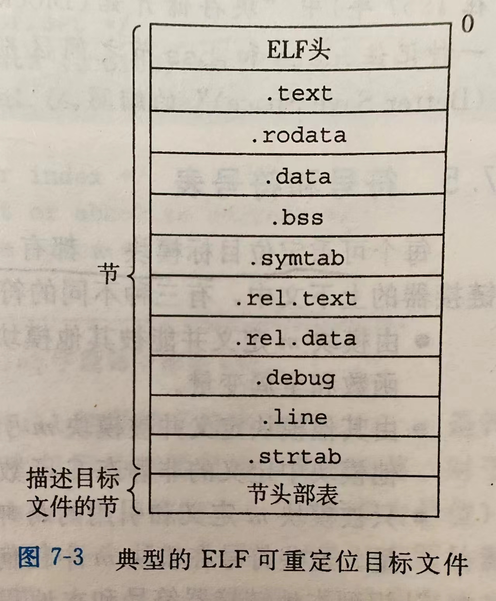
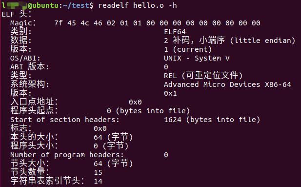

&nbsp;

<!--more-->
csapp有空会读一下，但是总是断断续续的再读，这样看完的东西太容易忘了，梳理记录一下，加深理解，后面回看的时候也方便快速回忆。

##    编译器驱动程序

### 源文件到可执行目标文件的过程

- $main.c(源文件)\xrightarrow{预处理器(cpp)}main.i(中间文件)\xrightarrow{编译器(cc1)}main.s(汇编文件)$
    						$\xrightarrow{汇编器(as)}main.o(可重定位目标文件)\xrightarrow{链接器ld}a.out(可执行目标文件)$
- 过程中的工具链:
  - 预处理器：将对代码做一些预处理操作如：宏定义的文本替换，将头文件的内容复制到include处等
  - 编译器：将.i文件翻译成汇编文件格式为.s，文件内容为可阅读的汇编代码，因为汇编代码与cpu的指令集相关联，所以是不可移植的。
  - 汇编器：将.s文件翻译成机器码文件，不可阅读（可以使用objdump来将.o文件转换为汇编格式）
  - 链接器：将多个.o文件链接合并成一个可执行文件，过程中涉及符号解析，重定位。


### Linux中可执行目标程序（不依赖动态库）的运行过程

1. shell中输入运行可执行文件
2. shell调用操作系统加载器(操作系统API--exec函数族也是这个原理)
3. 加载器将可执行目标文件中的代码和数据复制到内存中
4. 加载器跳转到程序的入口点(\_start函数)，执行\_start函数.  _start函数是系统目标文件ctrl.o中定义的，对所有C程序都一样
5. \_start函数调用系统启动函数 \__libc_start_main(定义在libc.so中),初始化执行环境，然后调用用户层的main函数。

### 目标文件

目标文件有三种：

- 可重定位目标文件：.o文件，包含二进制代码和数据，包含各种节(section)：代码节、数据节等等，每个节都是一个连续的二进制字节序列。
- 可执行目标文件：应用程序文件，由一系列可重定位目标文件合可共享目标文件(非必须)合并组成
- 共享目标文件：静态或动态库，可由一系列可重定位目标文件生成

目标文件在不同系统上具有不同格式。现代x86-64Linux和Unix采用ELF（Executable and Linkable Format，执行可链接格式）格式，Windows采用PE（Portable Executable, 可移植可执行）格式

### 静态链接

静态链接器（Linux上为ld）以一组可重定位目标文件为输入，生成一个完全链接的可执行目标程序。

### 可重定位目标文件



上图来自CSAPP，描述了一个ELF可重定位目标文件的结构。大致结构就是以一个ELF头开始，后跟许多“节”，最后跟着一个“节头部表”。每个“节”的大小和位置都是由节头部表描述的，每个节都拥有一个固定大小的条目。


- **ELF头内容**

  - "ELF头"以一个16字节的序列开始，该序列描述了生成该文件的系统的字的大小和字节顺序.

  - 剩余的部分包含：ELF头的大小、目标文件的类型、机器类型、节头部表的文件偏移、节头部表中条目的大小和数目。

  - 用readelf解析elf头的例子

    

- 剩余各个“节”

  - .text节：已编译程序的机器代码
  - .rodata节：只读数据，例如一些字符串常量、switch语句的跳转表
  - .data节：已初始化的全局变量和静态C变量。局部变量在运行时保存在栈中  ，既不在.data节也不再.bss节。
  - .bss节：未初始化的全局和静态C变量、被初始化为0的全局或静态变量。在目标文件中不占实际空间，仅仅为一个占位符。在目标文件中，为初始化变量在程序运行前会分配在内存中程序的数据段中，且初始化为0；（注：这里的占位符应该是节头部表中会有.bss节的条目，且符号表中会记录属于.bss段的数据，所以目标文件中可以不存在.bss段实际内容）
  - .symtab：符号表。存放在程序中定义和引用的函数和全局变量的信息（即除了栈变量的全部变量信息）。每个可重定位目标文件都会存在一份符号表
  - .rel.text：一个.text节中的列表（描述代码段的重定位信息，用于对.text代码段进行重定位），当链接器把这个目标文件和其他文件组合时需要修改这些位置（重定位）。一般而言任何外部函数和引用全局变量的指令都需要修改。 
  - .rel.data：被模块引用或定义的所有全局变量的重定位信息（描述数据段的重定位信息，用于对.data数据段进行重定位）
  - .debug：一个调试符号表，其条目是程序中定义的局部变量和类型定义，程序中定义和引用的全局变量，以及原始的C源文件。只有以-g选项编译程序才会有这张表
  - .line：原始C源文件中的行号和.text节中机器指令之间的映射。也是只有以-g选项编译才会有。
  - .strtab:一个字符串表，其内容包含.symtab和.debug节中的符号，以及节头部中的节名字。是一个以null结尾的字符串序列。

### 符号解析

​	每个可重定位目标文件目标模块m都存在一个符号表(.symtab)，它包含m定义和引用的符号，一般有三种不同的符号：

- 有在m中定义并可以被其他模块引用的的全局符号，对应非静态函数和全局变量
- 其他模块定义并在m中被引用的全局符号（也叫外部符号），对应其他模块定义的非静态函数和全局变量
- 只在m中被引用且定义在m中的局部符号，对应static修饰的函数和全局变量。

非静态的局部变量的生存期和所在的栈帧相关，不记录在符号表中。

#### 符号表

符号表由汇编器根据.s文件中的符号（编译器输出的）构造的，.symtab节中包含ELF符号表。这张表包含一种特殊数据结构的数组。这种数据结构的格式如下(定义在/usr/include/elf.h文件中)：

```
typedef struct
{
  Elf64_Word	st_name;		/* Symbol name (string tbl index) */
  unsigned char	st_info;		/* Symbol type and binding */
  unsigned char st_other;		/* Symbol visibility */
  Elf64_Section	st_shndx;		/* Section index */
  Elf64_Addr	st_value;		/* Symbol value */
  Elf64_Xword	st_size;		/* Symbol size */
} Elf64_Sym;
```


### 链接静态库
### 重定位
### 动态库

