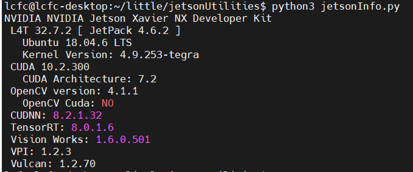
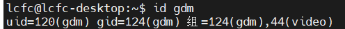
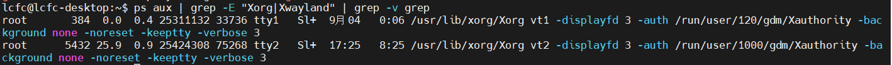
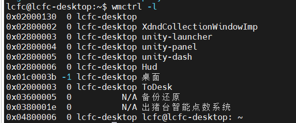

​	最近收到了一个截屏第三方软件界面的需求，借助大模型的帮助梳理了一个方法流程，实测可用，记录一下。
&nbsp;
<!--more-->

## 系统环境

### jetson系统信息读取

这个部分和本文主要想记录的内容不太相关，之前一直没有获取jetson盒子具体型号的方法，最近在stackoverflow上找到了，懒得单开一篇记录，在这里写一下。

- 读取工具从下面这个仓库获取即可

```
 https://github.com/jetsonhacks/jetsonUtilities.git
```

- 使用工具,执行如下指令

```
python3 jetsonInfo.py
```

- 当前系统输出结果,可以看到当前的盒子型号是 Jetson Xavier NX 



## 获取截图过程

1. 安装x11桌面相关工具

```
sudo apt install imagemagick wmctrl xdotool
```

2. 判断gdm的用户图形会话id(uid)

```
id gdm
```



3. 获取当前登录用户的X认证文件的路径

```
ps aux | grep -E "Xorg|Xwayland" | grep -v grep
```



4. 设置执行x11工具前的环境变量

```
export DISPLAY=:1
export XAUTHORITY=/run/user/1000/gdm/Xauthority ## 排除gdm会话的认证文件，剩下的就是用户图形会话的xorg进程
```

5. 获取X Window窗口所有可见窗口

```
wmctrl -l
```



6. 有目标窗口则可以使用import获取截图

```

import -window "$(wmctrl -l | grep -i todesk | awk '{print $1}')" ~/todesk_screenshot.png

##"$(wmctrl -l | grep -i todesk | awk '{print $1}')" 获取todesk窗口id
```
