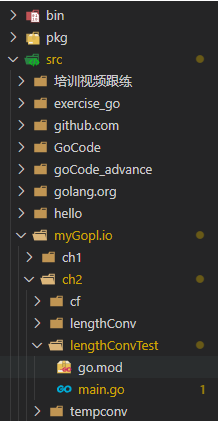

&nbsp;

<!--more-->
在go程序里引用自己写的包出现里下列报错：

```
src\myGopl.io\ch2\lengthConvTest\main.go:9:2: no required module provides package myGopl.io/ch2/lengthConv: working directory is not part of a module
```

这里是main里的import

```
import (
	"bufio"
	"fmt"
	"os"
	"strconv"

	"myGopl.io/ch2/lengthConv"
) 
```

lengthConv是自己写的包，

文件结构如下：



百度了许久，改下 go env 中的 GO111MODULE 参数 设置为 auto（cmd命令：go env -w GO111MODULE=auto），问题解决，可以运行。但是vscode导包的地方有黄下划线提示有问题

百度里找到相关介绍：

| GO111MODULE 值 | Go 1.13                                                      | <Go 1.13                                                     | Go 1.16                                                      |
| -------------- | ------------------------------------------------------------ | ------------------------------------------------------------ | ------------------------------------------------------------ |
| on             | 任何路径下都开启module-aware模式                             | 任何路径下都开启module-aware模式                             | 【默认值】：任何路径下都开启module-aware模式                 |
| auto           | 【默认值】：使用GOPATH mode还是module-aware mode，取决于要构建的源码目录所在位置以及是否包含go.mod文件。如果要构建的源码目录不在以GOPATH/src为根的目录体系下，且包含go.mod文件(两个条件缺一不可)，那么使用module-aware mode；否则使用传统的GOPATH mode。 | 【默认值】：只要当前目录或父目录下有go.mod文件时，就开启module-aware模式，无论源码目录是否在GOPATH外面 | 只要当前目录或父目录下有go.mod文件时，就开启module-aware模式，无论源码目录是否在GOPATH外面 |
| off            | gopath模式                                                   | gopath模式                                                   | gopath模式                                                   |

### go111module

`go111module` 是一个环境变量，通过该变量的配置，可以改变`go` 引用包的行为

同的`go` 版本，对于该环境变量有不同的表现:

(1) `go1.11` 和 `go1.12` 中的`go111module`

`go111module=on` 选项，将强制使用 `gomodule`模块管理包，即使项目位于`gopath`中

`go111module=off` 选项，将强制使用 `gopath`管理包，即使项目不在`gopath`中

`go111module=auto` 选项，是默认的选项，将根据情况分为:

a. 当位于`gopath`中，表现为 `go111module=off`

b. 当位于`gopath`外，表现为 `go111module=on`

(2) `go1.13` 中的`go111module`

a. 当存在 `go.mod` ，表现为 `go111module=on`

b. 当在`gopath`外，即使没有 `go.mod` ,表现为 `go111module=on`

c. 当在`gopath`内，并且没有`go.mod` 时候，表现为 `go111module=off`