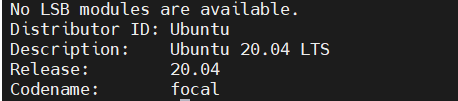
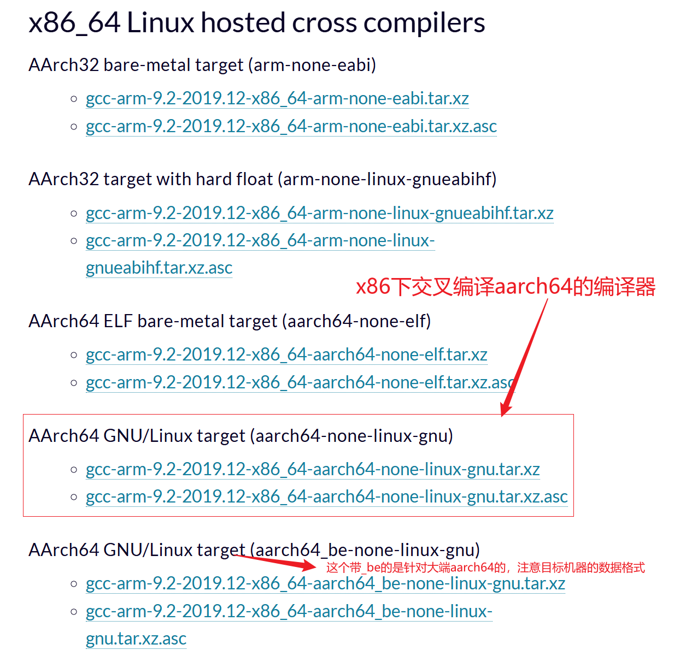
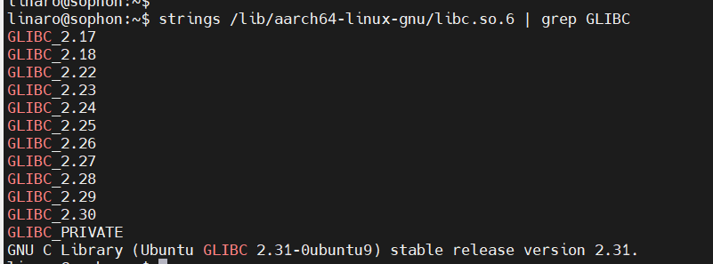
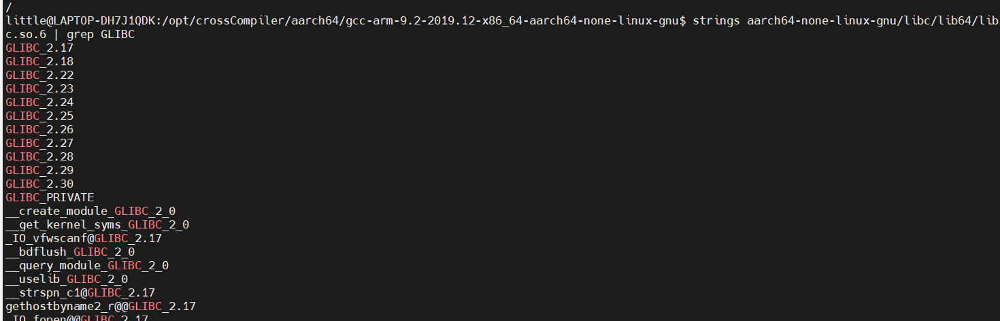
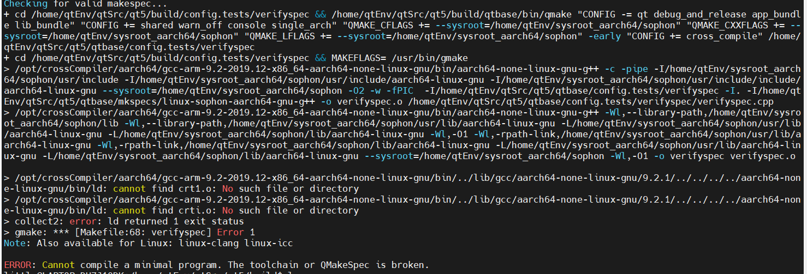
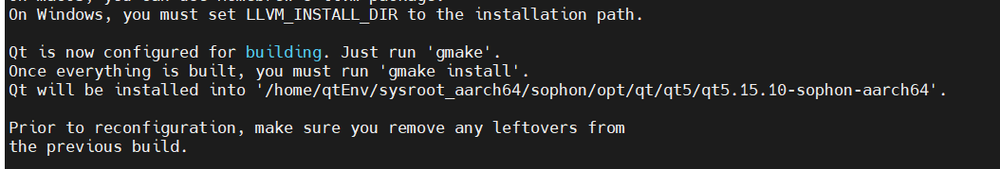

&nbsp;

​	最近我们的一个项目在找新的硬件平台代替现有的，给到我这边一个新的系统，也是终于看到弃用现在的半成品jetson的希望了。平台更换涉及项目移植，所以需要重新搭建一下开发环境，之前一直的编译都是直接在jetson上编译的，方便是方便，但是有一些不稳定因素。也尝试过在自己虚拟机里搭建交叉编译环境，折腾一两周，能编出来程序，因为要结合算法库的问题跑不起来，只搞了一个半成品。这里借助之前折腾的基础再搭建一次，并记录一下过程。

<!--more-->

- 参考文档

  ```
  https://wiki.qt.io/Building_Qt_5_from_Git
  https://doc.embedfire.com/linux/rk356x/Qt/zh/latest/lubancat_qt/install/install_arm_2.html
  https://blog.csdn.net/xuesong10210/article/details/122102483
  ```

  

- 当前系统版本

  

## 搭建目标机器环境

- 安装库和工具

  ```
  # 安装一些库和工具等,按自己需要安装
  sudo apt update
  
  # x11相关
  sudo apt-get install -y libx11-dev freetds-dev libxcb-xinput-dev libpq-dev libiodbc2-dev firebird-dev \
     libxcb1 libxcb1-dev libx11-xcb1 libx11-xcb-dev  \
     libxcb-keysyms1 libxcb-keysyms1-dev libxcb-image0 libxcb-image0-dev libxcb-shm0 libxcb-shm0-dev \
     libxcb-icccm4 libxcb-icccm4-dev libxcb-sync1 libxcb-sync-dev libxcb-render-util0 \
     libxcb-render-util0-dev libxcb-xfixes0-dev libxrender-dev libxcb-shape0-dev libxcb-randr0-dev \
     libxcb-glx0-dev libxi-dev libdrm-dev libxcb-xinerama0 libxcb-xinerama0-dev libatspi2.0-dev \
     libxcursor-dev libxcomposite-dev libxdamage-dev libxss-dev libxtst-dev libpci-dev libcap-dev \
     libxrandr-dev libdirectfb-dev libaudio-dev 
  
  # gstream相关
  sudo apt-get install -y libgstreamer1.0-0 gstreamer1.0-plugins-base \
     gstreamer1.0-plugins-good gstreamer1.0-plugins-bad gstreamer1.0-plugins-ugly \
     gstreamer1.0-libav gstreamer1.0-doc gstreamer1.0-tools libunwind-dev
  
  # opengl相关
  sudo apt-get install -y  libegl1-mesa-dev libgbm-dev libgles2-mesa-dev libgles2-mesa
  
  #C/C++ 开发套件
  sudo apt-get install gcc g++ gdbserver rsync
  sudo apt install build-essential
  
  
  
  
  # 其他等等
  sudo apt-get install -y libfreetype6-dev libicu-dev  libasound2-dev libnss3-dev \
  libxss-dev libxtst-dev libpci-dev libcap-dev libsrtp2-dev libsrtp2-1 libxrandr-dev libdirectfb-dev \
  libaudio-dev libavcodec-dev libavformat-dev libswscale-dev 
     
  sudo apt-get install git bison python3 gperf pkg-config gdb-multiarch
  sudo apt-get install -y libssl-dev libdbus-1-dev libglib2.0-dev  rsyslog  libjpeg-dev
  #下面是opengl、xcb相关需要安装的库
  sudo apt-get install libxkbcommon-dev libxkbcommon-x11-dev
  sudo apt-get install libxext-dev libxfixes-dev 
  
  sudo apt-get install libfontconfig1-dev  #QT中-fontconfig选项的依赖
  sudo apt-get install sqlite3 libsqlite3-dev   #解决qt中配置系统数据库的依赖问题，对应-sqlite选项
  sudo apt-get install libts-dev      #解决tslib依赖 对应-tslib选项。
  sudo apt-get install libjpeg-dev    #-system-jpeg 选项
  sudo apt-get install libglib2.0-dev    #-glib 选项
  sudo apt-get install sqlite3 libsqlite3-dev   #解决sqlite依赖
  sudo apt-get install rsyslog     #-syslog选项
  ```

- 转换目标机器sysroot相关动态库路径链接方式

  这一步的目的是可以避免sysroot复制到编译机上还要处理动态库链接失效问题

  - 安装symlinks
  
    ```
    sudo apt install symlinks
    ```

  - 转换/lib、/usr/include、 /usr/lib、/opt中的动态库的链接方式为相对路径链接
  
    ```
    sudo symlinks -rc /opt
    sudo symlinks -rc /lib
    sudo symlinks -rc /usr
    ```
  

## 编译机环境搭建

- 拷贝目标机各类库到编译机（创建目标机sysroot）

  我这里因为目标机是算能的设备所以sysyroot起名为sophon。加--copy-unsafe-links选项是因为单纯拷贝软连接可能会出现sysroot内符号链接失效问题，sysroot的可用性会变差，影响后续编译qt源码

```
rsync -avz --rsync-path="sudo rsync" --copy-unsafe-links --delete linaro@192.168.5.60:/usr/lib sophon/usr/
rsync -avz --rsync-path="sudo rsync" --copy-unsafe-links --delete linaro@192.168.5.60:/usr/include sophon/usr/
rsync -avz --rsync-path="sudo rsync" --copy-unsafe-links --delete linaro@192.168.5.60:/opt/sophon sophon/opt/sophon/	
rsync -avz --rsync-path="sudo rsync" --copy-unsafe-links --delete linaro@192.168.5.60:/usr/libexec sophon/usr/
rsync -avz --rsync-path="sudo rsync" --copy-unsafe-links --delete linaro@192.168.5.60:/usr/share sophon/usr/
```

- 下载qt5源码

  ```
  git clone https://code.qt.io/qt/qt5.git
  ```

- 切换版本为5.1.5.10

  ```
  cd qt5
  git checkout v5.8.0                                  # checking out the specific release or branch
  git submodule update --init --recursive              # updating each submodule to match the supermodule
  ```

- 下载交叉编译器

  ```
  ## 下载地址
  https://developer.arm.com/downloads/-/gnu-a
  ```

  

- 确定目标机器的glibc版本和交叉编译器的glibc版本是否兼容

  - 两个glic版本不一兼容后续编译qt源码会有问题，出现编译失败问题

  ```
  #查看目标系统glibc版本
  strings $${sysroot}/lib/aarch64-linux-gnu/libc.so.6 | grep GLIBC
  ##交叉编译工具链glibc版本
  strings $${crossCompilerPath}/aarch64-linux-gnu/libc/lib64/libc.so.6 | grep GLIBC	
  		#或
  strings $${crossCompilerPath}/aarch64-none-linux-gnu/libc/lib64/libc.so.6 | grep GLIBC
  ```

  - 目标机器上的glibc版本

      

  - gcc9.2交叉编译器的glibc版本

    

  - 可以看到这里范围都是2.17--2.30，这个9.2版本的gcc应该是可以作为交叉编译器的版本的。而且选择9.2版本的gcc是因为目标机的gcc版本是9.3在arm官网上能找到和9.3最接近的版本就是9.2版本

  - 测试交叉编译器，在目标机器编写hello例然后在编译机器上执行交叉编译，将编译出来的程序拷贝至目标机器上执行，初步验证交叉编译器的可用性。

    ```
    ## 1.交叉编译hello 
    /opt/crossCompiler/aarch64/gcc-arm-9.2-2019.12-x86_64-aarch64-none-linux-gnu/bin/aarch64-none-linux-gnu-g++ hello.cpp -o hello
    ## 2.拷贝hello程序至目标机器
    rsync -avz hello linaro@192.168.5.53:/home/linaro/
    ## 3.目标机器上执行hello，验证hello是否可用
    ```

  

## 交叉编译Qt源码

- 拷贝qt源码的qtbase/mkspecs目录下的编译配置模板为自定义编译配置

  ```
  cd ${QtSrc}/qtbase/mkspecs
  cp -a linux-aarch64-gnu-g++ linux-sophon-aarch64-gnu-g++
  ```


- 修改linux-sophon-aarch64-gnu-g++下的qmake.conf的内容如下

  ```
  #
  # qmake configuration for building with aarch64-linux-gnu-g++
  #
  
  MAKEFILE_GENERATOR      = UNIX
  CONFIG                 += incremental
  QMAKE_INCREMENTAL_STYLE = sublib
  
  include(../common/linux.conf)
  include(../common/gcc-base-unix.conf)
  include(../common/g++-unix.conf)
  
  QMAKE_LIBDIR_OPENGL_ES2 += $$[QT_SYSROOT]/usr/lib/aarch64-linux-gnu
  QMAKE_INCDIR_OPENGL_ES2 += $$[QT_SYSROOT]/usr/include/
  QMAKE_LIBS_OPENGL_ES2  += -lGLESv2 -lEGL
  #QMAKE_LIBS_OPENGL_ES2  += -lGLESv2 -lEGL -lmali
  
  QMAKE_INCDIR_OPENGL += $$[QT_SYSROOT]/usr/include/
  QMAKE_LIBDIR_OPENGL += $$[QT_SYSROOT]/usr/lib/aarch64-linux-gnu
  QMAKE_LIBS_OPENGL      += -lGL -lEGL
  
  QMAKE_INCDIR_XCB += $$[QT_SYSROOT]/usr/include
  
  QMAKE_INCDIR_EGL += $$[QT_SYSROOT]/usr/include
  QMAKE_LIBDIR_EGL += $$[QT_SYSROOT]/usr/lib/aarch64-linux-gnu
  QMAKE_LIBS_EGL         += -lEGL -lGLESv2
  #QMAKE_LIBS_EGL         += -lEGL -lGLESv2 -lmali
  
  QMAKE_INCDIR_FONTCONFIG += $$[QT_SYSROOT]/usr/include
  
  #QMAKE_CFLAGS            = -march=armv8-a
  QMAKE_CXXFLAGS          = $$QMAKE_CFLAGS
  
  QMAKE_CFLAGS += -I$$[QT_SYSROOT]/usr/include
  QMAKE_CFLAGS += -I$$[QT_SYSROOT]/usr/include/aarch64-linux-gnu
  QMAKE_CFLAGS += -I$$[QT_SYSROOT]/usr/include/include/aarch64-linux-gnu
  
  QMAKE_CXXFLAGS += -I$$[QT_SYSROOT]/usr/include
  QMAKE_CXXFLAGS += -I$$[QT_SYSROOT]/usr/include/aarch64-linux-gnu
  QMAKE_CXXFLAGS += -I$$[QT_SYSROOT]/usr/include/include/aarch64-linux-gnu
  
  QMAKE_LFLAGS += -Wl,--library-path,$$[QT_SYSROOT]/usr/lib/aarch64-linux-gnu
  QMAKE_LFLAGS += -Wl,--library-path,$$[QT_SYSROOT]/lib
  
  QMAKE_LFLAGS += -L$$[QT_SYSROOT]/usr/lib/aarch64-linux-gnu
  QMAKE_LFLAGS += -L$$[QT_SYSROOT]/lib/aarch64-linux-gnu
  
  QMAKE_LFLAGS += -Wl,-O1 \
                  -Wl,-rpath-link,$$[QT_SYSROOT]/usr/lib/aarch64-linux-gnu \
                  -Wl,-rpath-link,$$[QT_SYSROOT]/lib/aarch64-linux-gnu \
                  -L$$[QT_SYSROOT]/usr/lib/aarch64-linux-gnu \
                  -L$$[QT_SYSROOT]/lib/aarch64-linux-gnu
  
  
  # modifications to g++.conf
  QMAKE_CC                = /opt/crossCompiler/aarch64/gcc-arm-9.2-2019.12-x86_64-aarch64-none-linux-gnu/bin/aarch64-none-linux-gnu-gcc
  QMAKE_CXX               = /opt/crossCompiler/aarch64/gcc-arm-9.2-2019.12-x86_64-aarch64-none-linux-gnu/bin/aarch64-none-linux-gnu-g++
  QMAKE_LINK              = /opt/crossCompiler/aarch64/gcc-arm-9.2-2019.12-x86_64-aarch64-none-linux-gnu/bin/aarch64-none-linux-gnu-g++
  QMAKE_LINK_SHLIB        = /opt/crossCompiler/aarch64/gcc-arm-9.2-2019.12-x86_64-aarch64-none-linux-gnu/bin/aarch64-none-linux-gnu-g++
  
  # modifications to linux.conf
  QMAKE_AR                = /opt/crossCompiler/aarch64/gcc-arm-9.2-2019.12-x86_64-aarch64-none-linux-gnu/bin/aarch64-none-linux-gnu-ar cqs
  QMAKE_OBJCOPY           = /opt/crossCompiler/aarch64/gcc-arm-9.2-2019.12-x86_64-aarch64-none-linux-gnu/bin/aarch64-none-linux-gnu-objcopy
  QMAKE_NM                = /opt/crossCompiler/aarch64/gcc-arm-9.2-2019.12-x86_64-aarch64-none-linux-gnu/bin/aarch64-none-linux-gnu-nm -P
  QMAKE_STRIP             = /opt/crossCompiler/aarch64/gcc-arm-9.2-2019.12-x86_64-aarch64-none-linux-gnu/bin/aarch64-none-linux-gnu-strip
  load(qt_config)
  
  ```

- qt源码下新建build目录并在build下执行configure

  ```
  mkdir build && cd build
  ../configure \
       -opensource \
       -confirm-license \
       -sysroot /home/qtEnv/sysroot_aarch64/sophon  \          ##指定sysroot路径
       -xplatform linux-sophon-aarch64-gnu-g++ \				 ##指定使用的编译配置,用前面我们自定义的这个
       -prefix /opt/qt/qt5/qt5.15.10-sophon-aarch64 \          ##编译后qt安装的位置
       -release \
       -nomake tests \
       -nomake examples \
       -make libs \
       -opengl es2 \
       -egl \
       -eglfs \
       -xcb \
       -dbus \
       -sqlite \
       -syslog \
       -fontconfig \
       -pkg-config \
       -tslib \
       -feature-dlopen \
       -skip qtscript \
       -skip qtwebengine \
       -skip qtdocgallery \
       -no-use-gold-linker \
       -v \
       -recheck-all
  ```

- 处理configure执行报错


    - crt库查找失败

      

      使用arm的gcc编译器好像就会出现这种问题，其只在sysroot的lib下查找crt文件、但是crt文件一般都是在lib/aarch64-linux-gnu 下的，所以需要在lib目录下创建crt文件的链接

      ```
      #进入sysroot中
      cd /home/qtEnv/sysroot_aarch64/sophon
      # 确保 lib 是指向 usr/lib 的（原始状态）
      ls -l lib
      # 应该是：lib -> usr/lib
      # 进入 lib 目录（即实际是 usr/lib）
      cd lib
      # 在这里创建指向 aarch64-linux-gnu 下 crt 文件的符号链接
      sudo ln -sf aarch64-linux-gnu/crt1.o .
      sudo ln -sf aarch64-linux-gnu/crti.o .
      sudo ln -sf aarch64-linux-gnu/crtn.o .
      ```


- configure执行成功后执行make等待编译结束然后make install



```
gmake -j6 #-j6指示使用多线程并行编译，缩短编译完成时间
gmake install
```

- 大功搞成，美美编译项目
